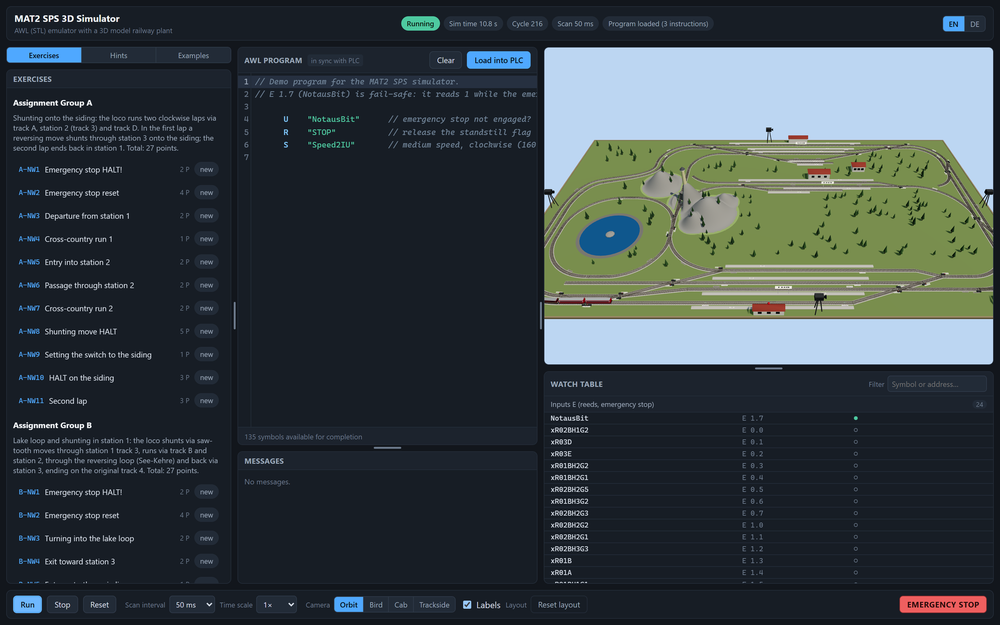

# MAT2 SPS 3D Simulator

A browser-based teaching simulator for the **MAT2 SPS-Praktikum** (TU Dresden): a Siemens
S7-300 **AWL/STL** emulator driving a deterministic 3D model of the practicum's model-railway
plant.

You write AWL, load it into the emulated PLC, press Run — and watch the train, the switch
motors and the process image react in real time. That feedback loop is the point: the real
remote practicum gives you a graded text file, this gives you the plant.



*Left: both assignments, network by network, with automatic checks. Centre: the AWL editor.
Right: the plant in 3D and the live process image. Here a three-line demo program has released
the standstill flag and set `Speed2IU`, so the loco is running clockwise at 160 mm/s —
`NotausBit` shows green in the watch table because the emergency stop is released.*

- **86 track nodes / 101 edges**, 36 placed switches (7 further symbols carried as *unplaced*),
  45 reed-contact positions of which 23 are wired to PLC inputs
- **Fahrstrom** on output word `AW 6`, fail-safe emergency stop on input `E 1.7`
- Four cameras: **Orbit, Bird, Cab, Trackside**
- Both official assignments (**Gruppe A** and **Gruppe B**, 11 networks each) as an exercise
  browser with automatic behaviour checks and three-level hints
- 18 runnable example snippets from the course manual
- Interface **English by default, German toggle**, choice persisted in the browser
- **No backend, no install required to run** — `npm run build` produces one self-contained
  `dist/index.html` (1,26 MB) that opens by double-click

---

## 1. Requirements

| | |
|---|---|
| **To run a prebuilt file** | any current browser with **WebGL2** (Chrome/Edge 113+, Firefox 115+, Safari 16+). Nothing else. |
| **To build from source** | **Node.js 24** and npm. Verified on Node v24.13.0 / npm 11.6.2. Node 20+ very likely works; 24 is what the gates run on. |
| **Hardware** | any GPU that runs WebGL2. The scene has a quality switch; the plant simulation itself is CPU-only and cheap. |

Check your Node version before starting:

```bash
node -v
```

## 2. Start the program

Three routes. **Route A is the one to use if you just want to run it.**

### Route A — run the prebuilt single file (no toolchain)

1. Get `dist/index.html` (build it once with Route C, or take it from a release).
2. **Double-click it.** It opens in your default browser and runs.

That works from `file://` because the build inlines *all* JavaScript and CSS into that single
HTML file. A normal ES-module bundle would be blocked by CORS on `file://`; this one is not.

If your browser refuses to open local files, serve the folder instead:

```bash
npx serve dist
```

Then open the URL it prints (usually `http://localhost:3000`).

### Route B — development server (hot reload)

```bash
npm install
npm run dev
```

Vite prints a local URL — by default **http://localhost:5173**. Open it. Editing anything under
`src/` reloads the page instantly.

To pin a different port:

```bash
npx vite --port 5183 --strictPort
```

### Route C — build the single file yourself

```bash
npm install
npm run build
```

This writes:

```
dist/index.html     ~1,26 MB   (everything inlined; gzip ≈ 361 kB)
dist/favicon.svg
```

Double-click `dist/index.html`, or preview it through a real HTTP origin:

```bash
npm run preview
```

## 3. First run — what to click

Once the page is open:

1. **Write or paste AWL** into the *AWL program* editor (centre column). You can also open the
   **Examples** tab and press *Insert into editor* on any of the 18 snippets.
2. Press **Load into PLC** (or `Ctrl+Enter`). The program is parsed; errors and warnings appear
   in the *Messages* panel underneath, each with a line number you can click.
3. Press **Run** in the *Controls* bar. The cyclic scan starts and the train begins to move.
4. Watch it: switch between **Orbit / Bird / Cab / Trackside** in the camera selector. *Labels*
   toggles the white `xW…` / `xR…` name plates in the 3D view.
5. Open the **Watch table** (right column) to see live inputs, the `AW 6` output word, switch
   coils `M 100 – M 111`, your own flags `M 10 – M 20`, timers and the counter.

Other controls worth knowing:

- **Stop** halts the scan and keeps the state; **Reset** clears PLC memory, timers, counters
  and puts the plant back to its start position.
- **EMERGENCY STOP** is a latching button: it drives `E 1.7` (`NotausBit`) to **0**. Fail-safe
  logic, exactly like the real plant — *your* program has to react and stop the train. Press
  *Release* to restore it.
- **Scan interval** (10–200 ms) is the simulated PLC cycle time; **Time scale** (0,25× – 8×)
  speeds up or slows down simulated time. The plant physics always integrates at a fixed 10 ms
  step regardless, so results stay reproducible.
- After loading a program, clickable **input toggles** appear for the `E` addresses it uses —
  that is how the manual's timer and edge examples can be exercised without the railway.

### Working through the assignments

Open the **Exercises** tab, pick *Gruppe A* or *Gruppe B*, then a network. You get the original
German task text, an English translation, and **Run checks** — which loads your program into a
fresh PLC and plant and replays that network's scenario deterministically (fixed seed, 50 ms
scan). The 3D view is not disturbed by a check run.

The **Hints** tab gives three graduated levels per network — *Concept*, *Pattern*, *Checklist*.
They unlock after a failed check run, after five minutes on the network, or immediately via
*I'm stuck*. Hints never contain the answer.

### Layout

The three columns and the panels inside them are resizable: drag the splitters, or focus one
and use the arrow keys (`Shift` = larger step). Double-click, `Home` or `End` restores a
splitter's default. *Reset layout* restores everything. The layout is remembered.

## 4. Things that surprise people

- **The simulation pauses while the browser tab is in the background.** Deliberate: the loop is
  driven by `requestAnimationFrame`, which browsers stop for hidden tabs, and letting wall-clock
  time "catch up" afterwards would destroy the fixed-step determinism the checks rely on. Bring
  the tab to the front and it resumes exactly where it stopped.
- **Symbol names are case-sensitive**, exactly like the real practicum: `XW03CR` is not
  `xW03CR`. The editor's autocompletion offers the correct spelling, and a wrong one is
  reported rather than silently accepted.
- **Seven switch symbols exist in the variable list but not on the track plan.** Using one is
  not an error in your program — the simulator reports `W-SWI-001` and tells you to pick a
  switch that is actually on the board.
- Your editor content and language choice are kept in `localStorage`
  (`mat2sps.editor.v1`, `mat2sps.locale`). Clearing site data resets both.

## 5. Troubleshooting

| Symptom | Cause and fix |
|---|---|
| Blank page, console says WebGL | The browser has no WebGL2 (often a VM or a very old GPU driver). Try another browser, or enable hardware acceleration. |
| `dist/index.html` opens but stays empty | You opened `index.html` from the **repository root**, not from `dist/`. The root one is the Vite source template and needs the dev server. |
| `npm run dev` fails with a port error | Port 5173 is in use. `npx vite --port 5183 --strictPort`. |
| `npm install` fails on an old Node | Check `node -v`. Use Node 24. |
| Program loads but nothing moves | Press **Run** — loading and running are two separate steps. Also check the emergency stop is not latched. |
| `E-LEX-001` errors on every line | You pasted the raw course template. That is supported: the simulator detects the template and extracts only the program sections — if it did not, check the `--Bitte hier programmieren--` markers are intact. |

## 6. Repository layout

| Path | Contents |
|---|---|
| `src/core/` | AWL tokenizer, parser, diagnostics, S5 timers/counters, the emulator — pure |
| `src/plant/` | track graph, train physics, switches, reeds, `Fahrstrom` — pure, seeded PRNG only |
| `src/app/` | `SimCoordinator`, `SimClock`, `Wiring`, `EventBus`, `RafDriver` |
| `src/scene/` | Three.js scene, track/train/switch meshes, labels, landscape, four camera rigs |
| `src/ui/` | app shell, CodeMirror 6 editor, panels, `i18n` (EN source of truth + DE) |
| `src/pedagogy/` | exercise and example loaders, behaviour checks, hint gating, progress |
| `src/data/` | `trackplan.json`, `variables.json`, `exercises.json`, `examples.json` |
| `tools/` | data generators and validators, release helper |
| `tests/` | 64 vitest suites, mirroring the module layout |

`core/` and `plant/` are **pure**: no DOM, no wall clock, no `Math.random()` — ESLint enforces
both the module boundaries and the determinism rules. New user-visible strings go through
`src/ui/i18n`; `en.ts` is the source of truth for the key type and `de.ts` is a total record
that `tsc` keeps complete, so a missing translation is a compile error.

## 7. Development

```bash
npm install
npm run dev          # Vite dev server with hot reload
npm run build        # → dist/index.html (single file, opens from file://)
npm run preview      # serve the built bundle over HTTP
```

### The four gates

Every change must leave all four green:

```bash
npm run gates        # typecheck → lint → test → build, fail-fast
```

Individually:

```bash
npm run typecheck    # tsc --noEmit, strict + noUncheckedIndexedAccess
npm run lint         # eslint over src/, tests/, tools/
npm run test         # vitest run
npm run build        # must succeed and stay file://-openable
```

`npm run lint` is the authoritative lint invocation — it passes explicit globs, so every `.ts`
file under `src/`, `tests/` and `tools/` is linted regardless of ESLint directory expansion.

There is also a release check that additionally proves the built bundle was really scanned:

```bash
npm run release-check
```

### A note on skipped tests in a fresh clone

This repository publishes **code only**. The design documents, the two course task templates
(`Gruppe_A/B_Aufgabe_SS2026.txt`) and the course variable list are not part of it. A handful of
tests read those files and therefore **skip cleanly** when they are absent — they are guarded,
not deleted, so they run at full strength on a machine that has them. A fresh clone still runs
all four gates green; it just proves slightly less.

## 8. Solutions policy

Worked solutions for the two assignments are **test oracles only**. They live in a local,
git-ignored `Claude_work/` directory, are read from the filesystem at test time, and are never
imported from `src/`, never bundled and never committed.

- Without that directory the oracle suites skip cleanly. A fresh clone is unaffected.
- `tests/oracle/no-bundle.test.ts` always runs. It asserts that `src/` carries no solution
  content and that a built `dist/` carries none either. With `MAT2SPS_REQUIRE_DIST=1` (what
  `npm run release-check` sets) a missing `dist/` is a failure rather than a skip, so the check
  cannot pass vacuously. It ends with a self-test on synthetic solution-shaped input.
- Hint texts are guarded too: no plant or system operand names beyond those the task text
  itself already prints.

## 9. Status and licence

Milestone 1 — emulator, plant, 3D scene, pedagogy layer, bilingual UI — is complete and
verified. Planned next: a block model (FC/FB/DB with `CALL`), a cycle inspector, watch-table
forcing, OPAL export/import, FUP/KOP views, and a scene editor for placing the remaining
switches and reeds.

No licence has been granted yet, so default copyright applies (all rights reserved). The
practicum's own material — task statements, the variable list, the track plan — belongs to
TU Dresden and is reproduced here only to the extent the simulator needs it.

---

## Kurzanleitung (Deutsch)

**Was es ist:** ein Lern-Simulator des SPS-Praktikums (MAT2, TU Dresden) — ein AWL-Emulator für
den S7-Befehlsumfang des Praktikums plus ein deterministisches 3D-Modell der Modellbahnanlage.
Kein Server, alles läuft im Browser. Die Oberfläche ist auf Englisch und Deutsch verfügbar
(Umschalter oben rechts, die Auswahl wird gespeichert).

### Starten

**Ohne Installation:** `dist/index.html` doppelklicken — die Datei enthält das komplette
Programm (1,26 MB, alles eingebettet) und läuft direkt aus dem Dateisystem. Falls der Browser
lokale Dateien blockiert: `npx serve dist`.

**Aus dem Quellcode** (Node.js 24 erforderlich):

```bash
npm install
npm run dev      # Entwicklungsserver, http://localhost:5173
npm run build    # erzeugt dist/index.html
```

### Bedienung

1. AWL in den Editor schreiben oder aus dem Tab *Beispiele* einfügen.
2. **In SPS laden** (oder `Strg+Enter`) — Fehler und Warnungen erscheinen darunter mit
   Zeilennummer.
3. **Start** drücken. Der Zyklus läuft, der Zug fährt.
4. Kamera umschalten (*Orbit, Vogel, Führerstand, Streckenrand*), *Beschriftungen* blendet die
   Schilder `xW…`/`xR…` ein. Die Beobachtungstabelle rechts zeigt Eingänge, das Ausgangswort
   `AW 6`, die Weichenspulen `M 100 – M 111`, Zeiten und den Zähler.

Der **NOT-AUS** rastet ein und legt `E 1.7` (`NotausBit`) auf **0** — fail-safe wie an der
echten Anlage: Ihr Programm muss den Zug anhalten. *Zykluszeit* (10–200 ms) und *Zeitraffer*
(0,25× – 8×) sind getrennt einstellbar; die Fahrphysik rechnet immer mit festen 10 ms.

Im Tab *Aufgaben* stehen beide Aufgabenstellungen (Gruppe A und B, je 11 Netzwerke) mit
**Prüflauf** und gestuften Hinweisen (*Konzept, Muster, Checkliste*).

### Wichtig

- Die Simulation **pausiert**, solange der Browser-Tab im Hintergrund ist. Das ist Absicht —
  der feste 10-ms-Takt bleibt dadurch reproduzierbar.
- Symbolnamen sind **groß-/kleinschreibungsempfindlich**, genau wie im Praktikum
  (`XW03CR` ≠ `xW03CR`).
- Sieben Weichensymbole stehen in der Variablenliste, aber nicht im Gleisplan. Ihre Verwendung
  meldet `W-SWI-001`.

### Entwicklung

`npm run gates` muss vor jedem Commit grün sein (Typprüfung, Lint, Tests, Build).

**Lösungen** dienen ausschließlich als Test-Orakel, liegen lokal und git-ignoriert unter
`Claude_work/` und gelangen nie in `src/`, in das Bundle oder in die Versionsverwaltung. Fehlt
das Verzeichnis, werden die Orakel-Suiten sauber übersprungen.
