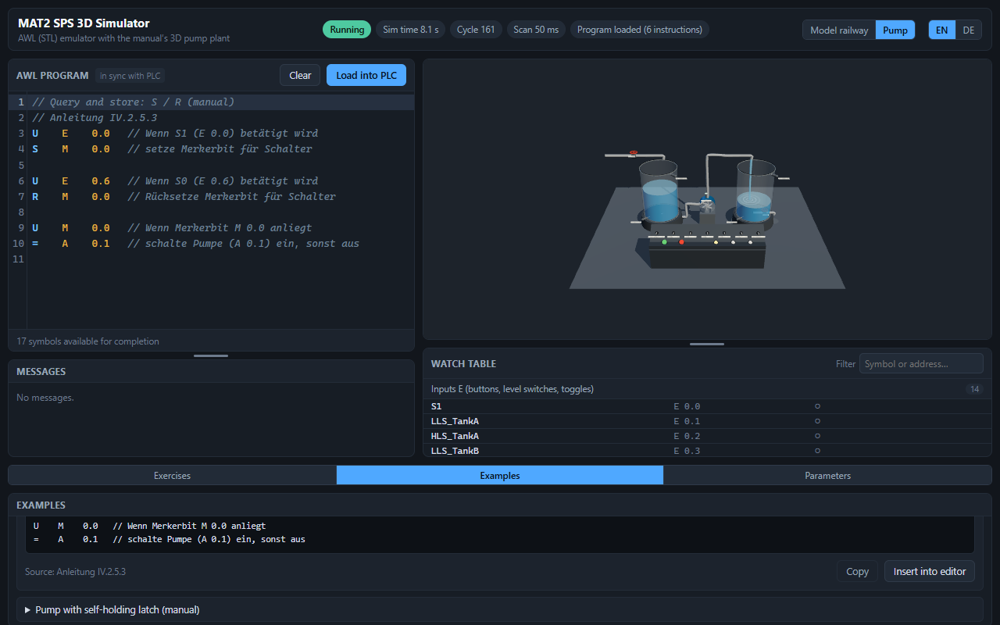
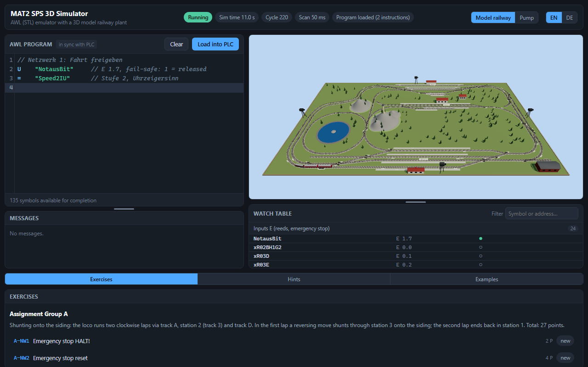

# MAT2 SPS 3D Simulator

A pedagogical, browser-based 3D simulator of the **MAT2 SPS-Praktikum** at TU Dresden: an
S7-300 **AWL/STL** emulator (Milestone-1 instruction subset) driving a deterministic model of
the practicum's model-railway plant — 36 placed switches, 23 wired reed contacts, the
`Fahrstrom` word `AW 6`, the fail-safe emergency-stop input `E 1.7` — rendered as a 3D layout
with four camera modes.

The point is the feedback the real remote practicum cannot give: write a program, load it into
the PLC, watch the train, the switch motors and the process image react — and get graded,
localized diagnostics plus progressive hints while you work. Both official assignments
(Gruppe A and Gruppe B, 11 networks each) ship as an exercise browser with automatic behaviour
checks. The interface is bilingual: **English by default, German toggle**, persisted locally.

The app carries a **second experiment**: the manual's pump/two-tank teaching example
(Anleitung IV.2.5.2), switchable in the header. Every AWL instruction the manual introduces —
binary logic, all five S5 timers, edges, jumps, counters — can be tried against a live plant:
momentary buttons, level sensors with adjustable thresholds, hand valves, and the water
rendered in simulation time.





**▶ How-to video (3:45, both experiments):**
[howto-mat2-sps.mp4](https://github.com/pmquang87/mat2-sps-simulator/releases/download/v0.2.0/howto-mat2-sps.mp4)
— loading an example, running it, the start-track chooser, cameras, input forcing and the
emergency stop on the railway; the experiment switcher, the pump examples, live parameters
and the hand valves on the pump plant.

There is **no backend**. Everything runs client-side; `npm run build` produces a single
self-contained `dist/index.html`.

---

## For students: run it

Two ways, no toolchain required:

1. **Double-click** `dist/index.html` (Explorer, or open it from the browser's *File → Open*).
   The build inlines all JavaScript and CSS into that one file precisely so the `file://`
   path works — plain ES-module bundles are CORS-blocked there.
2. **Serve it** if you prefer a real origin (or your browser blocks local files):

   ```sh
   npx serve dist
   ```

Then: type or paste AWL into the editor → **Load into PLC** → **Run**. The *Exercises* tab
holds both assignments with their task texts (German original + English translation), a
*Run checks* button per network, and hints that unlock as you go. The *Examples* tab holds the
runnable snippets from the Anleitung; loading one shows clickable **input toggles** in the
control bar, so timer and edge examples can be exercised without the railway.

A few things worth knowing:

- The simulation is **paused when the browser tab is hidden**. This is deliberate: the loop is
  driven by `requestAnimationFrame`, which the browser stops for background tabs, and letting
  wall-clock time "catch up" afterwards would break the fixed-step determinism the checks and
  the oracle rely on. Bring the tab back to the foreground and it continues exactly where it
  stopped.
- Symbol lookup is **case-sensitive**, exactly like the real practicum (`XW03CR` is not
  `xW03CR`) — the editor suggests the correct spelling when you get it wrong.
- Simulated time, PLC scan interval (10–200 ms) and time scale (0.25×–8×) are independent
  knobs in the control bar; the plant physics always steps at a fixed 10 ms.

## Development

Node 24, npm.

```sh
npm install
npm run dev          # Vite dev server with HMR
npm run build        # → dist/index.html (single file, opens from file://)
npm run preview      # serve the built bundle
```

Source layout (details and the binding design in `docs/ARCHITECTURE.md`):

| Path | Contents |
|---|---|
| `src/core/` | AWL tokenizer, parser, diagnostics, S5 timers/counters, the emulator — pure |
| `src/plant/` | track graph, train, switches, reeds, `Fahrstrom` — pure, seeded PRNG only |
| `src/app/` | `SimCoordinator`, `SimClock`, `Wiring`, `EventBus`, `RafDriver` |
| `src/scene/` | Three.js scene, meshes, labels, landscape, four camera rigs |
| `src/ui/` | app shell, CodeMirror 6 editor, panels, `i18n` (EN source of truth + DE) |
| `src/pedagogy/` | exercise/example loaders, behaviour checks, hint gating, progress |
| `src/data/` | `trackplan.json`, `variables.json`, `exercises.json`, `examples.json` |
| `tools/` | data generators/validators, release helper |
| `tests/` | vitest suites, mirroring the module layout |

`core/` and `plant/` are pure: no DOM, no wall clock, no `Math.random` (ESLint enforces the
module boundaries and the determinism rules). New user-visible strings in `src/ui/` go through
`src/ui/i18n` — `en.ts` is the source of truth for the key type, and `de.ts` is a total record
that `tsc` keeps complete.

## The four gates

Every change must leave all four green:

```sh
npx tsc --noEmit     # 0 errors (strict, noUncheckedIndexedAccess)
npx vitest run       # full suite
npx eslint src tests tools
npx vite build       # must succeed and stay file://-openable
```

One command, fail-fast, using the package scripts:

```sh
npm run gates        # typecheck → lint → test → build
```

The release variant additionally proves the shipped bundle was really scanned for leaked
solution content (see below):

```sh
npm run release-check   # build, then the suite with MAT2SPS_REQUIRE_DIST=1
```

(`npm run lint` is the authoritative lint invocation — it passes explicit globs, so every
`.ts` file under `src/`, `tests/` and `tools/` is linted regardless of ESLint's directory
expansion rules.)

## Solutions policy

Worked solutions for the two assignments are **test oracles only**. They live in a local,
git-ignored `reference/Claude_work/` directory, are read from the filesystem at test time, and are never
imported from `src/`, never bundled, and never committed.

- Without that directory the oracle suites **skip cleanly** (`describe.skipIf`) — a fresh
  clone runs all four gates green, it just proves less.
- `tests/oracle/no-bundle.test.ts` always runs: it asserts that `src/` and the committed
  documents under `docs/` carry no solution content, and that a built `dist/` carries none
  either. With `MAT2SPS_REQUIRE_DIST=1` (what `npm run release-check` sets) a missing or
  non-bundle `dist/` is a failure rather than a skip, so the check can never pass vacuously.
- Hint texts are guarded too: no plant or system operand names beyond those the task text
  itself prints (`tests/pedagogy/hints.test.ts`).

## Documentation & roadmap

- `docs/ARCHITECTURE.md` — the binding design: module contracts (§5), timing and determinism
  (§6), data schemas (§7), the G/R coil→branch mapping problem (§8), test plan (§9), pedagogy
  design (§10). **Milestone 2/3 extension points are §11, the register of flagged
  assumptions (speeds, AW 6 encoding, reed window, …) is §12** — read §12 before "fixing" a
  surprising constant.
- `docs/REQUIREMENTS.md`, `docs/ARCHITECTURE_BRIEF.md` — what was asked for, and the binding
  constraints.
- `reference/research/` — sourced notes behind the model (the Anleitung, the Hinweise, the
  Gleisplan, the switch video). Some files there are git-ignored because they contain
  solution-derived material.

---

## Kurzanleitung (Deutsch)

**Was es ist:** ein Lern-Simulator des SPS-Praktikums (MAT2, TU Dresden) — ein AWL-Emulator
für den S7-Befehlsumfang des Praktikums plus ein deterministisches Modell der Modellbahnanlage
in 3D. Kein Server, alles läuft im Browser; die Oberfläche ist auf Englisch und Deutsch
verfügbar (Umschalter oben rechts, Auswahl wird gespeichert).

**Starten (ohne Installation):** `dist/index.html` doppelklicken. Alternativ `npx serve dist`,
falls der Browser lokale Dateien blockiert. Dann: Programm in den Editor schreiben →
**In SPS laden** → **Start**. Im Tab *Aufgaben* stehen beide Aufgabenstellungen mit
Prüflauf und gestuften Hinweisen, im Tab *Beispiele* die lauffähigen Schnipsel der Anleitung.
Nach dem Laden erscheinen in der Bedienleiste anklickbare **Eingangs-Schalter** für die
E-Adressen des Programms — damit lassen sich Zeit- und Flankenbeispiele ohne die Anlage
ausprobieren.

**Wichtig:** Die Simulation pausiert, solange der Browser-Tab im Hintergrund ist. Das ist
Absicht — der feste 10-ms-Takt bleibt dadurch reproduzierbar. Symbolnamen sind
groß-/kleinschreibungsempfindlich, genau wie im Praktikum.

**Entwicklung:** `npm install`, `npm run dev`, `npm run build`. Vor jedem Commit müssen alle
vier Prüfungen grün sein: `npm run gates` (Typprüfung, Lint, Tests, Build).

**Lösungen:** Musterprogramme dienen ausschließlich als Test-Orakel, liegen lokal und
git-ignoriert unter `reference/Claude_work/` und gelangen nie in `src/`, in das Bundle oder in die
Versionsverwaltung. Fehlt das Verzeichnis, werden die Orakel-Suiten sauber übersprungen.
